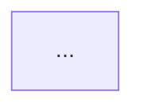

# Architecture Output Contract

Apply these rules while filling the template. Do not copy instructional prose or placeholder text into the finished document.

## Review-first rules

- Represent each fact once.
- Diagrams stay at **module and system boundaries**. Internal branches belong in `/program-design`.
- Coarse package/module layout — not per-file change maps.
- Public contracts only: endpoints, schemas, events, provider ids. Per-function signatures belong in `/program-design`.
- Label every fenced block.
- Use `mermaid` for before/after architecture and cross-module flow.
- Use the repository language for contracts.
- Use `text` only for coarse package trees or literal terminal output.
- Omit optional sections instead of filling them with placeholder prose.

## Frontmatter

```yaml
---
task: <short-kebab-slug>
type: architecture
repo: <org/repo or local path label>
branch: <current branch>
sha: <current commit sha>
status: active
spec_ref: <path or issue URL, or None>
superseded_by: <path, only when status is superseded>
---
```

---

# Architecture: <capability or change name>

## Summary

One short paragraph: the problem, the near-term scope, and why this system shape fits the repository.

## Current state

Bullet list of repository facts relevant to the change. What exists today, not product history.

## Desired end state

Bullet list of observable outcomes when the full capability is implemented across tickets. Write from the system's perspective.

## Not doing

Capability-level non-goals. Tickets may narrow further.

## Architecture

### Before



### After


One short paragraph: what new modules, boundaries, or flows appear and why.

## Proposed shape

### Module layout

Packages, top-level folders, or modules. Annotate responsibilities, not every file.

```text
packages/integrations/example/
  src/shared/     shared client, errors, paging
  src/mail/       ExampleMail service
  src/index.ts    stable exports
```

### Public contracts

Endpoints, schemas, events, or provider ids whose shape affects module boundaries. Mark proposed symbols. Omit function bodies.

```text
PUT /api/resources/:slug
  request:  { destination: string }
  response: { resource: Resource }
```

```sql
CREATE TABLE resource (
  slug         TEXT PRIMARY KEY,
  destination  TEXT NOT NULL,
  created_at   TIMESTAMPTZ NOT NULL DEFAULT now()
);
```

### Runtime flow

Path from entry to observable result at module boundaries. `mermaid` sequence for cross-module interaction, or a short numbered list for a linear flow. Collapse routine frames. Expose auth, transactions, external calls, and failure boundaries when relevant.

### API or method roadmap

Optional. When the capability exposes many operations over time, group by need (MVP, next slice, future). Do not map methods to file paths.

| Group | Operation | Need |
| --- | --- | --- |
| Connection | `testConnection()` | MVP |
| Messages | `listMessages(input)` | MVP |

## Verified basis

Include when the design depends on external APIs, vendor semantics, permissions, or compliance. Distil primary sources. Link official docs; `/research` holds the long form.

- ...

## Proposed slices

How `/to-tickets` should break the work. No files or test commands per slice.

### Slice 1: <title>

- **Delivers:** ...
- **Blocked by:** None
- **Architecture anchor:** ...

### Slice 2: <title>

- **Delivers:** ...
- **Blocked by:** ...
- **Architecture anchor:** ...

## Resolved architecture questions

One subsection per material decision. Omit when there are none.

### <Question heading>

**Chosen:** ... **Why:** ...

**Options not chosen:**

- **Option A:** ...
- **Option B:** ...

## Risks

Compact entries only when material. Omit when there are none.

- **Risk — <name>:** <impact>. **Mitigation:** <mitigation>.

## Approval gate

- **Blocking decisions:** None | list
- **Material assumptions:** ...
- **Next step:** `/program-design using <this-path>`

Changes to behaviour, public contracts, persistence, security, system boundaries, or the approved slice breakdown require updating this document and re-review.
